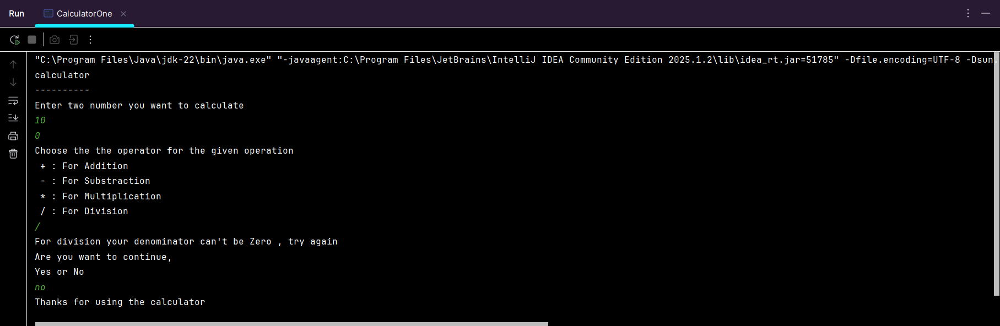
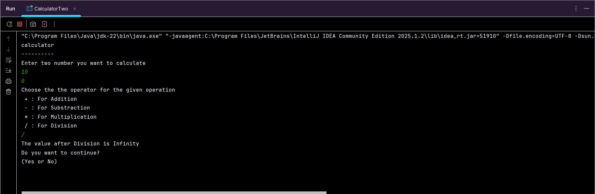

<!DOCTYPE html>
<html lang="en">
<head>
  <meta charset="UTF-8">
</head>
<body>

  <h1>🔢 Calculator Project</h1>

  

    A simple calculator application built in <strong>Java</strong> that performs basic arithmetic operations such as 
    <strong>addition</strong>, <strong>subtraction</strong>, <strong>multiplication</strong>, and <strong>division</strong>. 
    This project demonstrates basic programming concepts like user input, control flow, and exception handling.
  

  <h2>📌 Features</h2>
  <ul>
    <li>Addition</li>
    <li>Subtraction</li>
    <li>Multiplication</li>
    <li>Division</li>
    <li>Input validation</li>
    <li>Loop for multiple calculations</li>
  </ul>

  <h2>🛠️ Technologies Used</h2>
  <ul>
    <li>Java (JDK 8 or later)</li>
    <li>Java IDE IntelliJ</li>
  </ul>

  <h2>📁 Project Structure</h2>
  <pre>
CalculatorProject/
├── README.html
├── CalculatorOne.png
├── CalculatorTwo.png
└── src/
    └── CalculatorOne.java
    └── CalculatorTwo.java
  </pre>

  <h2>🚀 How to Run</h2>
  <ol>
    <li>Clone the repository:https://github.com/Swarup121/Calculator_using_Java.git 
      <code>git clone </code>
    </li>
    <li>Open the project in your IDE.</li>
    <li>Run the <code>Main</code> class.</li>
    <li>Follow the console instructions to calculate.</li>
  </ol>

  <h2>🧪 Sample Output</h2>

  <h3>📷 Output with <code>int</code> data type:</h3>
  
  
<strong>Explanation:</strong> In this output, the calculator uses the <code>int</code> data type. When division is attempted with 0 as the divisor (e.g., 10 / 0), Java throws an <code>ArithmeticException</code> because integer division by zero is not allowed. This must be handled using a try-catch block to avoid program termination.

  <h3>📷 Output with <code>float</code> data type:</h3>
  
 
<strong>Explanation:</strong> In this case, the calculator uses the <code>float</code> data type. Unlike integer division, dividing a float by 0 (e.g., 10.0 / 0.0) does not cause an exception in Java. Instead, it returns a special value: <code>Infinity</code>. This is defined behavior for floating-point arithmetic.

  <h2>🧑‍💻 Author</h2>
  

    <strong>Swarup Kumar Behera</strong> 
    GitHub: <a href="https://github.com/Swarup121">https://github.com/Swarup121</a>
  

  

</body>
</html>
